# Flan's Mod: Recoded

A rebuild of the classic *Flan's Mod* for **Minecraft 26.3 (Fabric)**: guns with real ballistics, vehicles, aircraft,
artillery, explosives, field gear and team battles with bots, written in Kotlin on top of established Fabric
libraries.

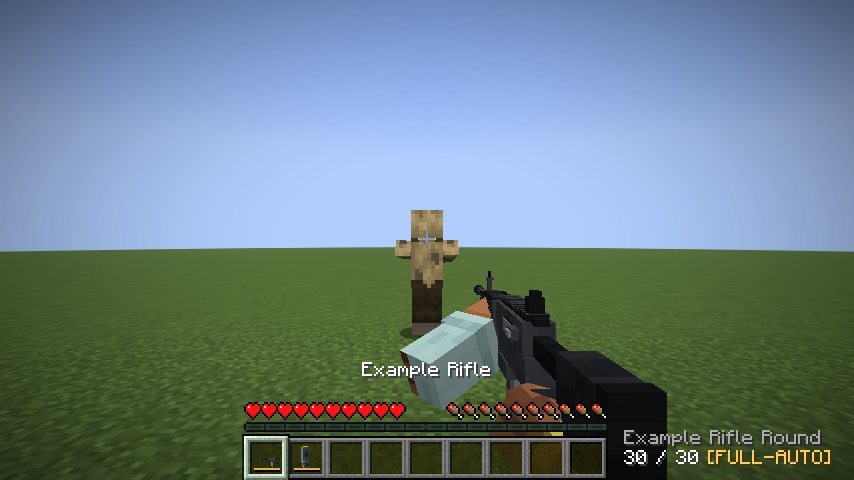
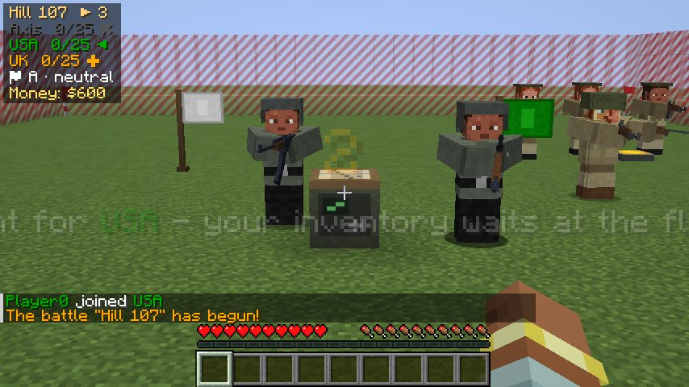

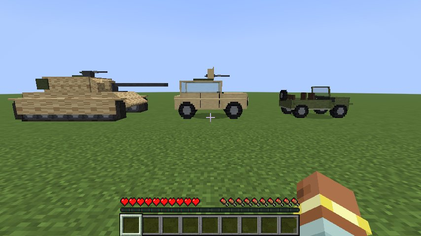
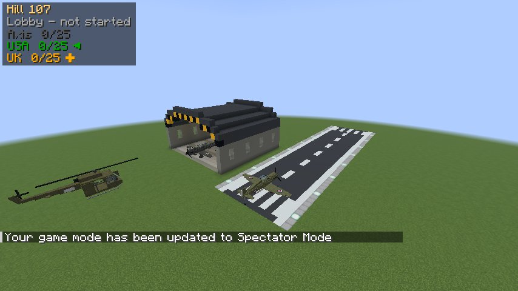

The mod is a **data-driven framework**. Guns, ammunition, vehicles, aircraft, emplacements, uniforms, grenades and
structures are not hard-coded: they come from **content packs** (JSON definitions, GeckoLib models, textures,
sounds). Three content packs ship with the mod (modern, vehicles, WW2), and they can be switched off like any other
pack.

**Contents:** [Installation](#installation) · [First steps](#first-steps) · [Guns](#guns) ·
[Crafting](#crafting-at-the-weapons-bench) · [Gear and movement](#gear-and-movement) ·
[Field utilities](#field-utilities) · [Explosives](#explosives) · [Vehicles](#vehicles) · [Aircraft](#aircraft) ·
[Emplacements and artillery](#emplacements-and-artillery) · [Fuel, cargo and upgrades](#fuel-cargo-and-upgrades) ·
[Fortifications and structures](#fortifications-and-structure-kits) · [Battles](#battles) · [Controls](#controls) ·
[Built-in packs](#built-in-content-packs) · [Content packs](#content-packs) · [Contributing](#contributing)

---

## Installation

Requires **Minecraft 26.3** and **Java 25**, plus:

| Mod | |
|---|---|
| [Fabric Loader](https://fabricmc.net/) ≥ 0.19.5 and [Fabric API](https://modrinth.com/mod/fabric-api) | required |
| [Fabric Language Kotlin](https://modrinth.com/mod/fabric-language-kotlin) | required |
| [GeckoLib](https://modrinth.com/mod/geckolib) 5.5 | required (models and animations) |
| [Cloth Config](https://modrinth.com/mod/cloth-config) | required (settings screens) |
| [Mod Menu](https://modrinth.com/mod/modmenu) | optional: client settings |
| [JEI](https://modrinth.com/mod/jei) | optional: shows Weapons Bench recipes |

1. Install Fabric Loader for 26.3 and start the game once.
2. Put the Flan's Mod jar and the mods above into `.minecraft/mods/`.
3. Extra content packs go into **`.minecraft/contentpacks/`** (folders or zips). The built-in packs are already in the
   jar; switch them on or off under *Options → Resource Packs* and, per world, under *Data Packs*.

On a server, install the same mods (Mod Menu and JEI are client-only) and put extra content packs into the server's
`contentpacks/` folder. Clients receive the definitions automatically, but they need the pack's assets (models,
textures, sounds), so they install the same packs.

---

## First steps

1. Open the creative inventory. Flan's adds tabs by type (*Weapons & Explosives, Ammunition, Attachments, Vehicles &
   Field Gear, Uniforms & Gear, Fortifications & Battles, Crafting*) and one tab per WW2 faction.
2. Take a gun and a few magazines of its caliber. Left click fires, right click aims, **R** reloads.
3. In survival, build a **Weapons Bench** (crafting table recipe) and assemble guns from parts.

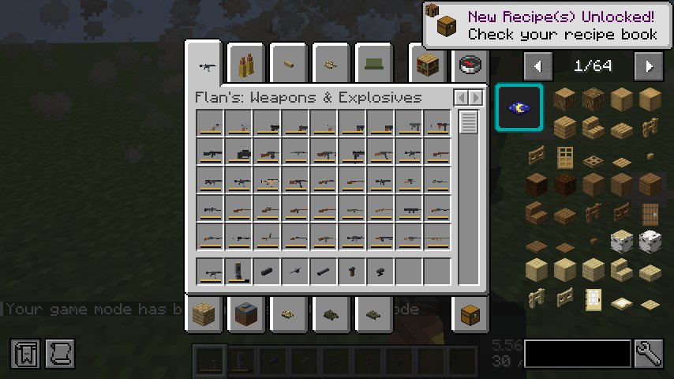
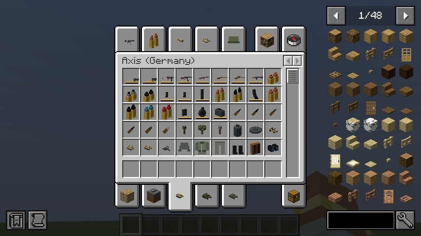

Every Flan's item explains itself in its tooltip: the category first (blue), then details, effects and what it
fits.

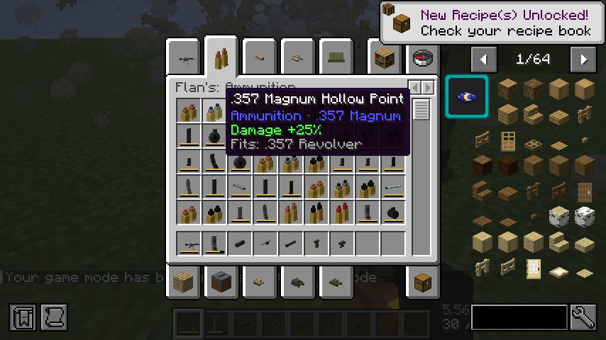

---

## Guns

- **Server-side ballistics:** bullets fly with drop and drag and are checked for hits every tick. The server decides
  every hit; your client only draws tracers and muzzle flashes.
- **Magazines:** guns only fire from an inserted magazine. **R** swaps in the fullest fitting magazine from your
  inventory, **Sneak+R** unloads. Right click a magazine to fill it with loose rounds. Guns with a built-in magazine
  (tube shotguns, launchers, some rifles) load loose rounds directly.
- **Calibers and ammo types:** rounds are named after their caliber ("5.56×45mm NATO"), and every gun of that
  caliber takes them:
  - FMJ, hollow point, AP, tracer, incendiary and API;
  - explosive (WW2 rifle calibers) and HEI (heavy calibers): a small blast where they hit;
  - buckshot, slug, dragon's breath and flechette for shotguns;
  - HE, HEAT and APFSDS for launchers and tank guns.
- **Fire modes:** safe, semi, burst, auto. **K** cycles.
- **Aiming:** right click aims down the gun's own sights. Scopes show an overlay, some with night vision or thermal.
  Recoil kicks the camera; lying down, crouching and bipods steady it.
- **Attachments:** sights, suppressors and flash hiders, grips, bipods, tripods, lasers. Hold the attachment in your
  off hand and press **J** (Sneak+J removes all), or use the weapon menu (**U**), which also sets the fire mode.

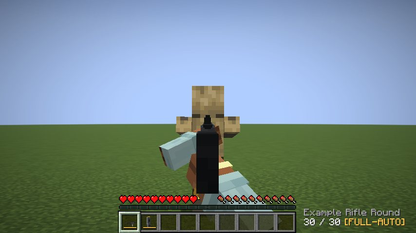
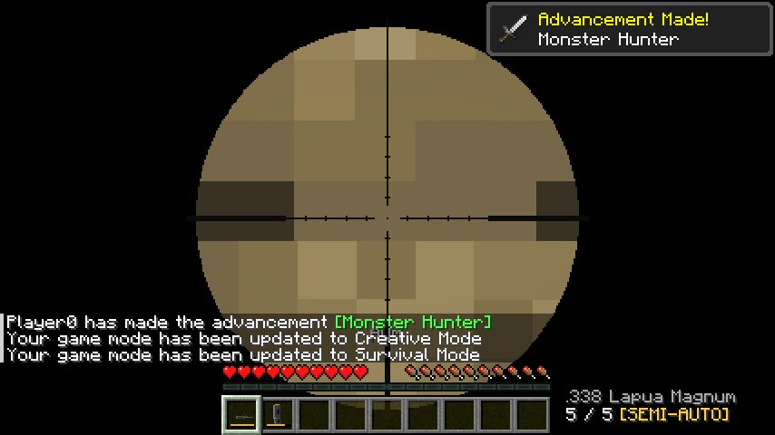
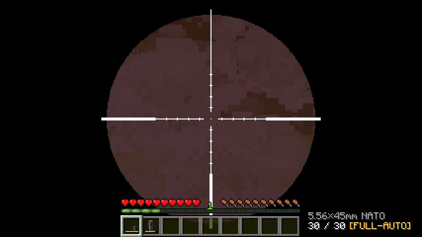

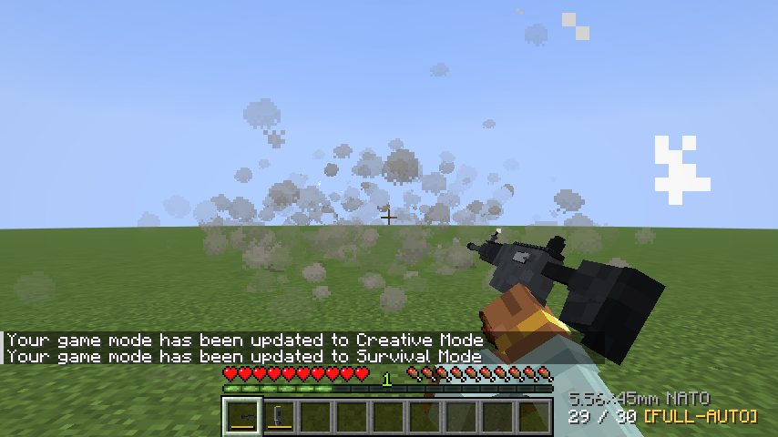
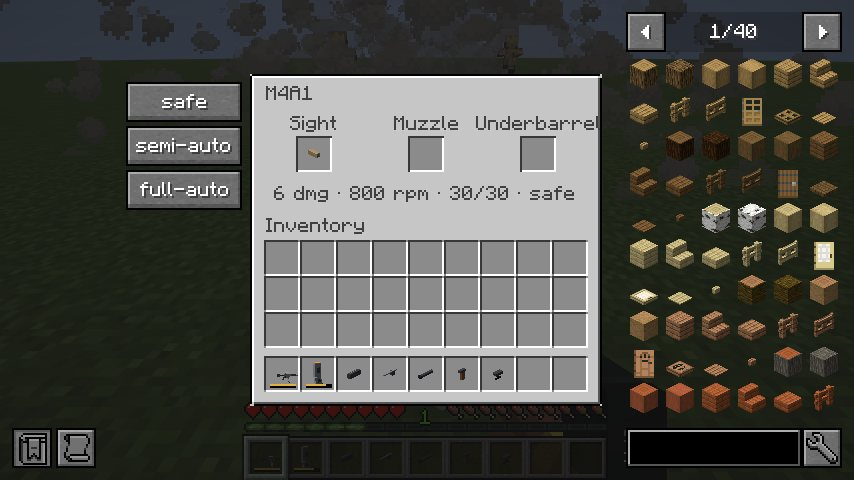
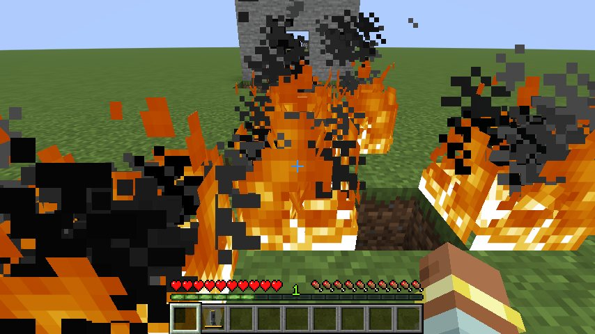

The built-in packs bring 24 modern and 21 WW2 guns:

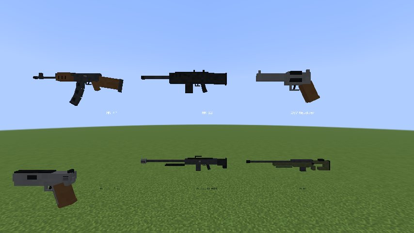
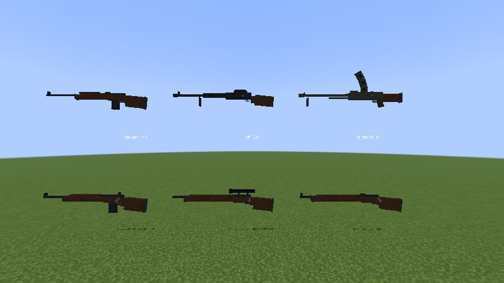

---

## Crafting at the Weapons Bench

Guns, magazines, ammunition, attachments, grenades, uniforms, gear, vehicles and structure kits are assembled at the
**Weapons Bench** on a 6×4 grid:

- **Guns** are built from parts (barrel, receiver, stock, ...), which are made from vanilla materials.
- **Rounds** need a casing of the caliber, gunpowder and a tip; the tip decides the ammo type (FMJ, AP, tracer, ...).
- **Shells, rockets and bombs** need a casing, gunpowder and a warhead or filling.
- **Vehicles and aircraft** are built from vehicle parts: wheels, tracks, engines, seats, rotor blades, wings,
  propellers and more.

With JEI installed, its recipe view shows the bench grid, and the "+" button fills it for you.

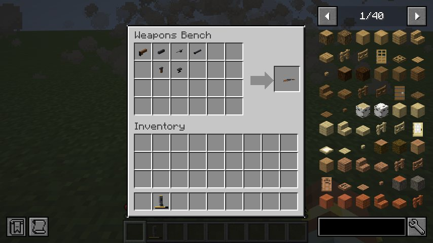
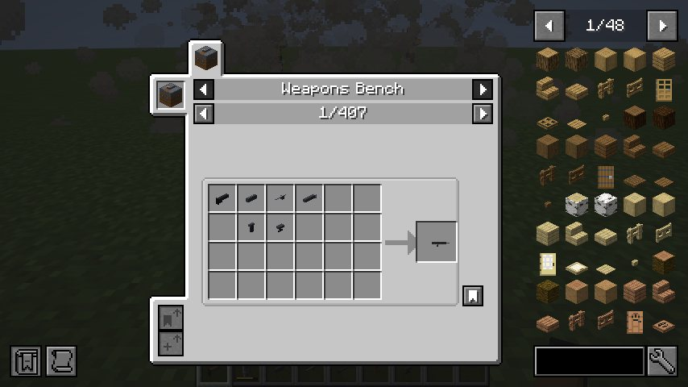

Tools, fuel machines, fortifications and battle blocks use the normal crafting table.

---

## Gear and movement

- **Backpack slot:** your inventory has a backpack slot above the off hand. The backpack in it is drawn on your back
  and opens with **B**. Sizes: assault pack (9 slots), rucksack (18), large field pack (27), plus four WW2 packs.
- **Armour plates:** modern armour (plate carrier, army jacket) shows **plate slots** while you wear it. Plates add
  armour, wear out with every hit and eventually break.
- **Ammo pouch:** holds ammunition, magazines, grenades and medical supplies only.
- **Medical supplies:** hold right click to use them on yourself, or right click someone else to treat them.
- **Binoculars:** 6× zoom.
- **Parachute:** carry it in the backpack slot (where it is drawn on your back) or anywhere in the inventory. Press
  **Space** while falling and it opens: you sink slowly and land without fall damage. It can be used again.
- **Prone (Z):** lie down and crawl, a smaller target with steadier aim. **Climb:** jump at a wall up to 2 blocks
  high. **Slide:** sneak while sprinting.
- **Bipods and tripods** set the gun down when you lie down (bipods also when crouching). **Lasers** show a dot that
  everyone can see.

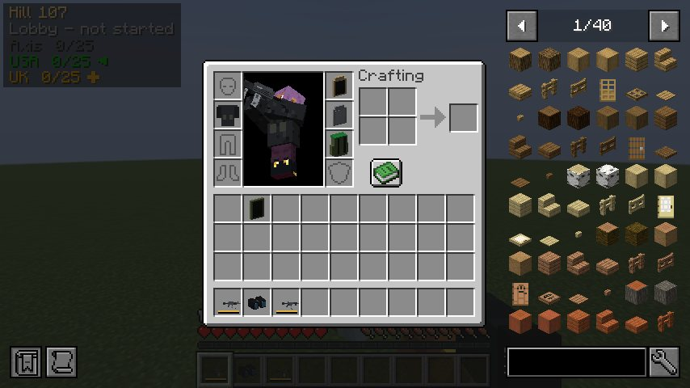
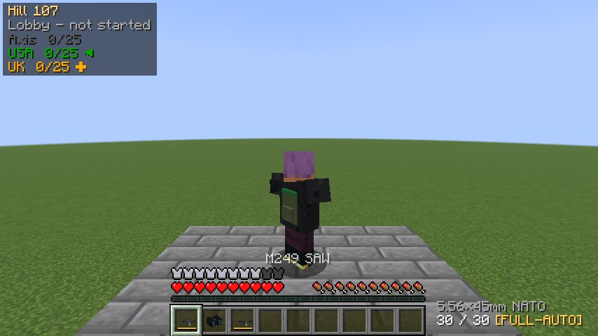
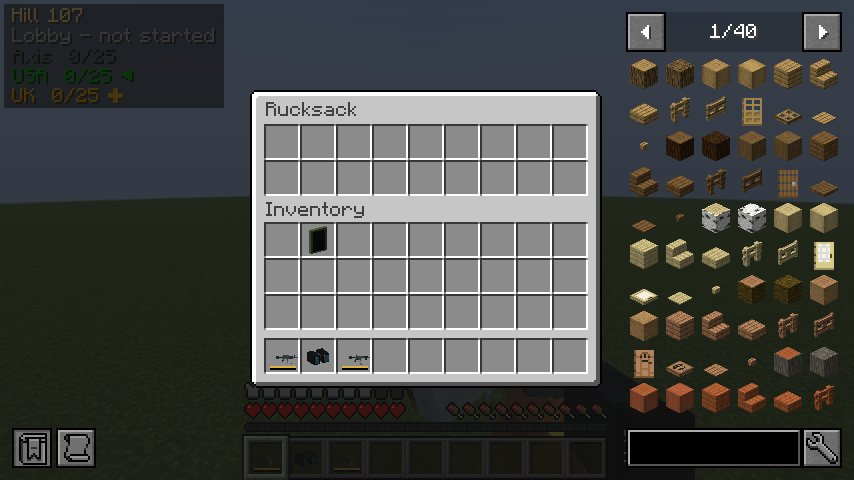

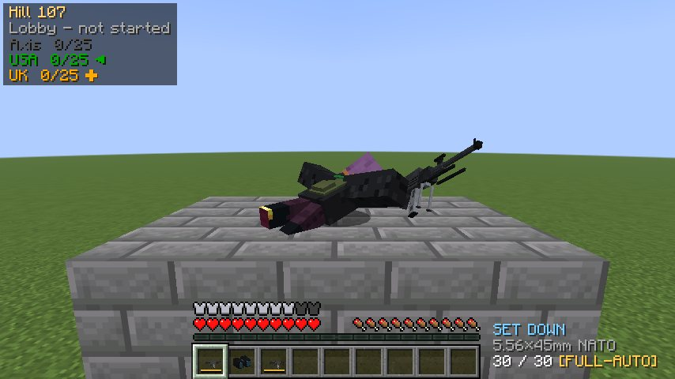
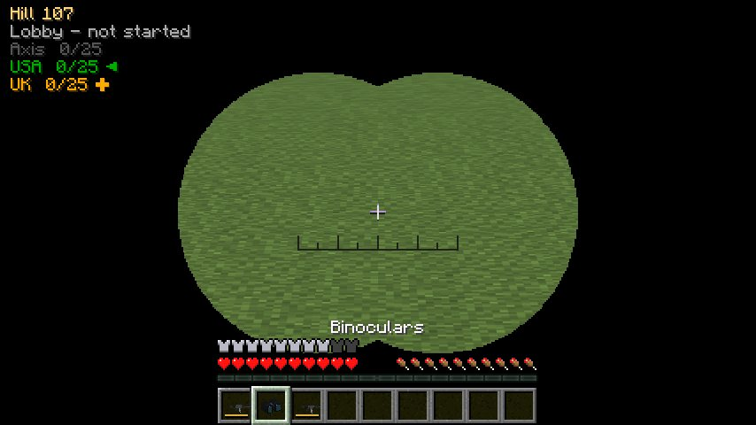
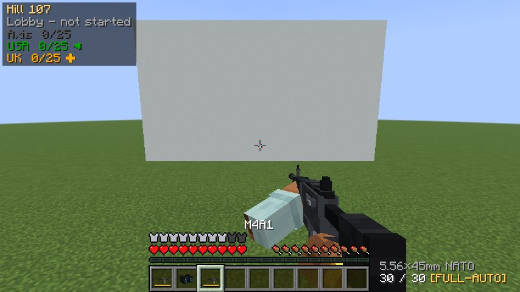

Uniforms are normal armour pieces in their faction's look:

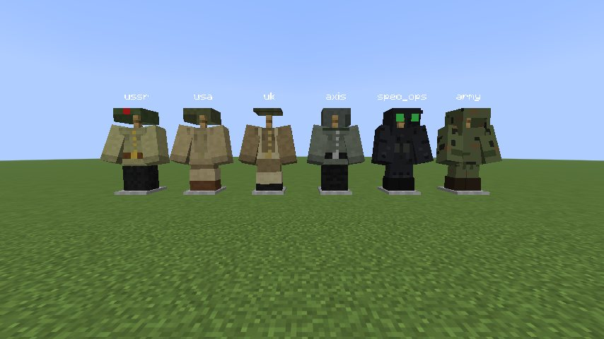

---

## Field utilities

- **Field map:** right click opens a terrain map of 160 blocks around you, with your position, your heading and your
  allies (never anyone else: it is no radar). Left click sets a waypoint, right click clears it.
- **Compass:** hold it in either hand for a heading strip at the top of the screen. It also points to the map's
  waypoint and shows how far away it is.
- **Flashlight:** right click switches it on. While you hold it, it lights the spot it points at, up to 24 blocks
  away, and everyone sees the light.

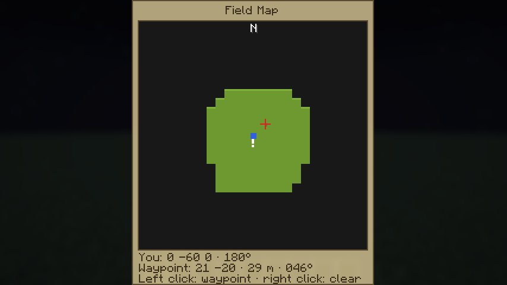
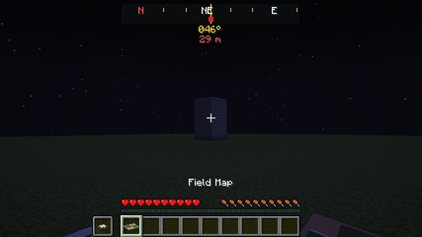
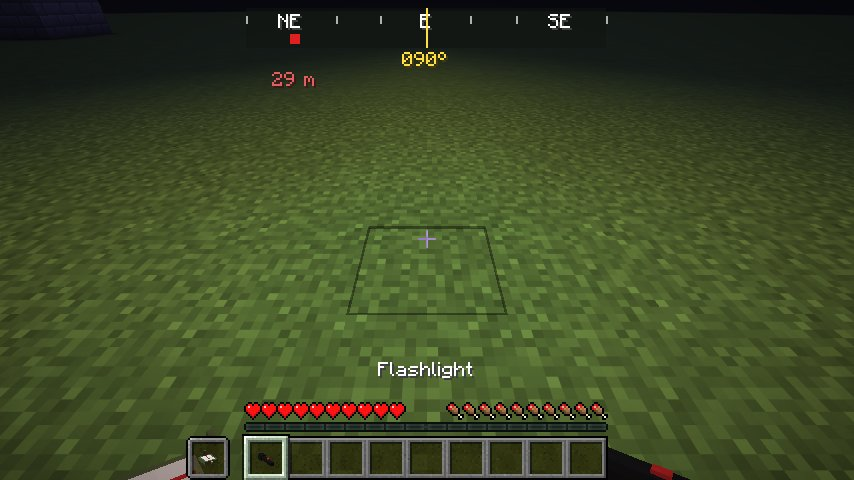

---

## Explosives

- **Grenades:** frag, concussion, impact, satchel charge, thermite, smoke, flashbang, incendiary, and the WW2 ones
  (stick grenade, Mk 2, Mills bomb, F-1, Geballte Ladung, Gammon bomb, RPG-40, white phosphorus, smoke). Right click
  throws.
- **Damage to the surroundings** depends on the type and stays modest: flashbangs break glass, frag grenades also
  soil, concussion charges sand, satchel charges wood and stone (but not sandbags or bunker concrete). The
  `tnt_explodes` gamerule switches it off.
- **Launchers** (M79, RPG-7, Bazooka) fire 40 mm grenades and rockets that destroy blocks.
- **Mines:** anti-personnel mines go off under anyone; anti-tank mines ignore people but wreck the wheel or track
  above them. Right click the ground to lay one; sneak + right click with an empty hand defuses it.

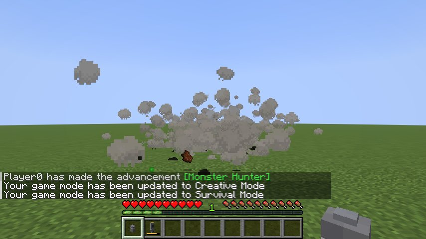

---

## Vehicles

Jeeps, trucks, APCs and tanks drive like boats: **W A S D** to drive, **Space** to brake.

- **Getting in and out:** right click near the seat you want, **Y** moves to the next free seat, and **Sneak** gets
  out.
- **Crew weapons:** turrets and gun mounts follow the gunner's view. Left click fires, **R** reloads from your
  inventory, and right click toggles the gunner's sight (with zoom and a matching reticle). The driver steers and
  doesn't shoot; passengers without a gun use their own.
- **Ammunition:** mounted guns load any round of their caliber. Tracer, incendiary and API rounds burn, explosive
  and HEI rounds burst where they hit, and tank guns fire HEAT, APFSDS, APCBC or HE.
- **Damage:** every part has its own hit box and health: hull, engine, fuel tank, wheels, tracks, turret, gun mount.
  Shot-off wheels slow you down, a dead engine stops you, and a holed fuel tank leaks.
- **Repair:** fix parts with the **wrench** and the hull with the vehicle's repair item.
- **Terrain:** the body rests on its wheels and tilts with the ground, and seats, guns and hit boxes tilt with it.
- **Picking up:** sneak + right click with an empty hand. The vehicle keeps its fuel, upgrades, damage and cargo.

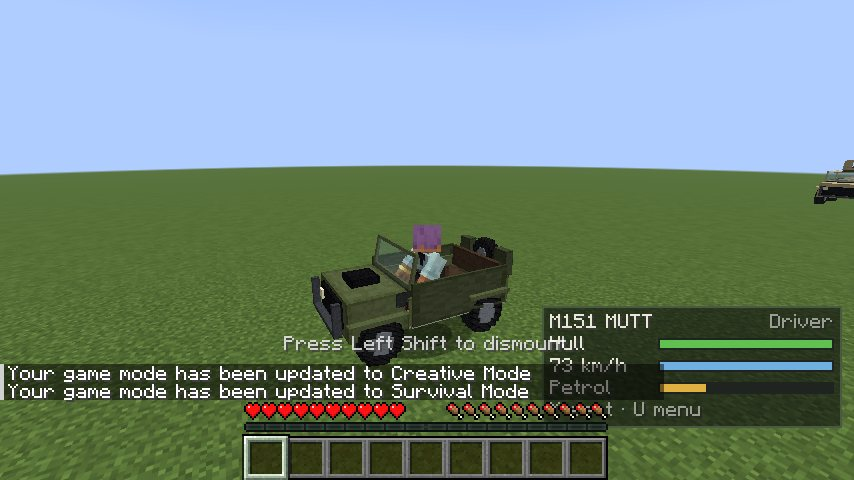
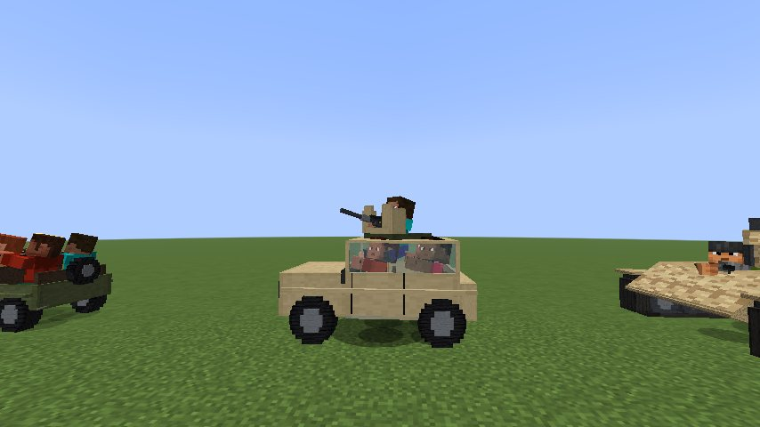

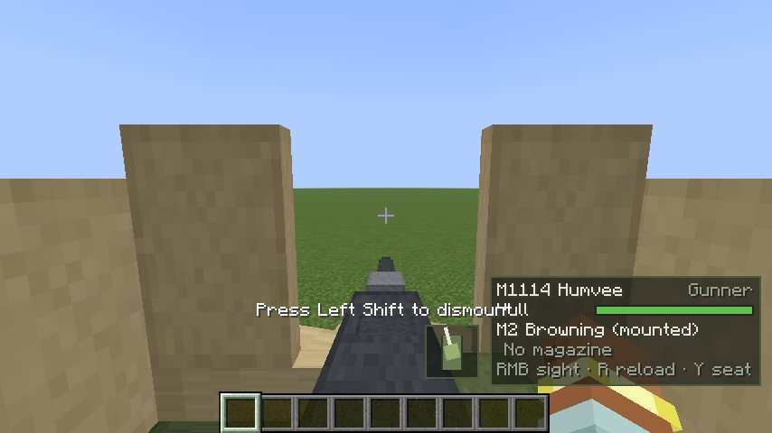
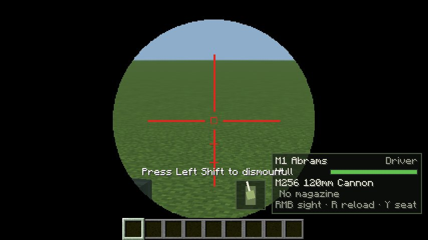
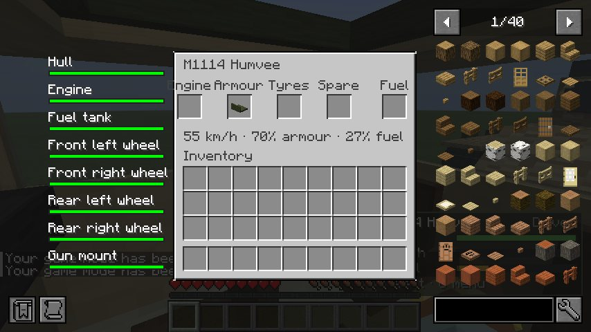

---

## Aircraft

**Planes** (Spitfire, Bf 109, P-51, Yak-3, and the attack planes Ju 87 Stuka, SBD Dauntless, Il-2 and Fairey Battle):

- **Throttle:** **W/S** set the throttle, which stays where you leave it.
- **Taking off:** on the runway, open the throttle, steer with **A/D**, and look up once the HUD speed is high enough.
- **Flying:** in the air the nose follows where you look. Below take-off speed the plane stalls and the nose drops.
  **Space** brakes.
- **Guns and bombs:** the guns fire along the nose, and right click toggles the reflector sight. **H** drops a bomb;
  it keeps the plane's speed, so release it before the target. Load bombs with **R** from your inventory.
- **Rear gunners:** the attack planes carry four bombs and a rear gunner. Press **Y** to take the rear seat and
  cover the tail.

**Helicopters** (UH-1H Huey with two door gunners and room for troops, AH-6 Little Bird with a minigun and rockets):

- **Flying:** **W/S** fly forward and back, **A/D** turn, **Space** climbs and **Ctrl** (sprint) descends. Without
  input the helicopter hovers.
- **Loss of power:** out of fuel, or with the rotor shot up, it comes down slowly.

**For all aircraft:**

- **Damage:** a shot-off wing or rotor costs its share of lift. Hard landings and flying into things damage the hull.
- **Bailing out:** sneak to jump out, then press **Space** to open your parachute.
- **HUD:** the pilot's HUD shows speed, throttle, altitude, climb rate and a stall warning.
- **Airfield:** the **runway** (13 × 48; chain several for a longer strip) and the **hangar** (room for a fighter or
  a helicopter) are structure kits.

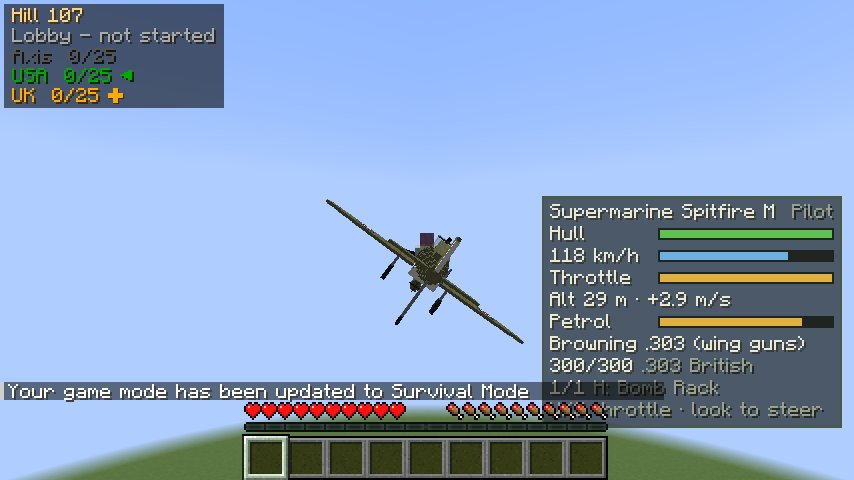
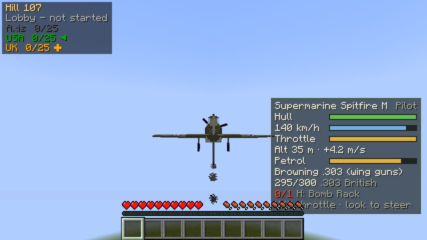
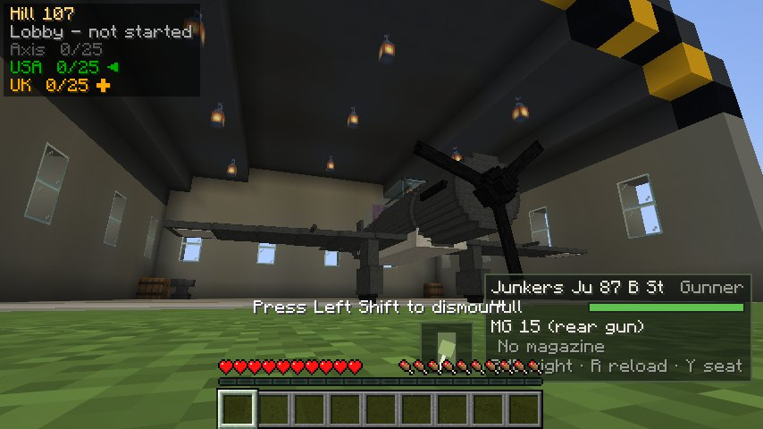

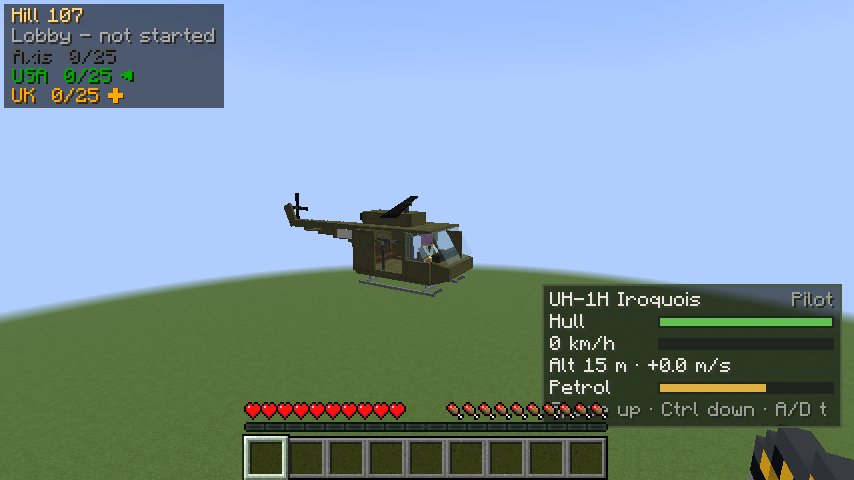
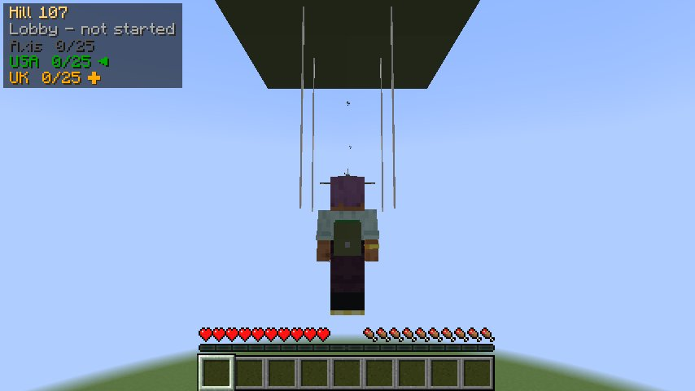

---

## Emplacements and artillery

Emplacements are placed like vehicles and stay where they are. Sit down to man them; sneak to leave.

- **Stationary guns:** tripod machine guns and a grenade launcher (M2HB, Mk 19; MG 42, M1919, Vickers, and the Maxim
  on its wheeled carriage). Aim with your view within the gun's traverse arc.
- **Anti-aircraft guns:** the ZU-23-2 and the 2 cm Flak 38, aimed with your view through a ring sight. **HE-FRAG**
  rounds burst next to aircraft (or at the end of their fuse); API, AP and tracer rounds are available too.
- **Sentry turrets:** the M240 sentry and the 23 mm air-defence sentry fight by themselves while nobody mans them.
  - **Targets:** hostile mobs, and in a battle also enemy fighters (the air-defence sentry also enemy aircraft).
    They never shoot anyone outside a battle.
  - **Reloading:** put magazines into the turret's cargo (sneak + right click with an item in hand) and it reloads
    from there.
  - **Kills** count for the player who placed it. Anyone can still man it by hand.
- **Mortars:** laid with the movement keys (**W/S** elevation, **A/D** traverse, **Space** for fine adjustment). A red
  ring marks where the shell will land, and the HUD shows elevation, bearing and range.
- **Artillery:** towed howitzers (M777, leFH 18, M2A1, QF 25-pounder, M-30) and the Type 63 rocket launcher are laid
  like mortars. They fire HE and smoke shells (rockets for the launcher) and keep spare rounds in their cargo.
  Howitzers take the flatter trajectory, mortars the high one.
- **Artillery map (N):** a top-down map with the range rings, where the gun points and where the shell will land.
  Click a point, or type its coordinates, and the gun lays itself onto it.

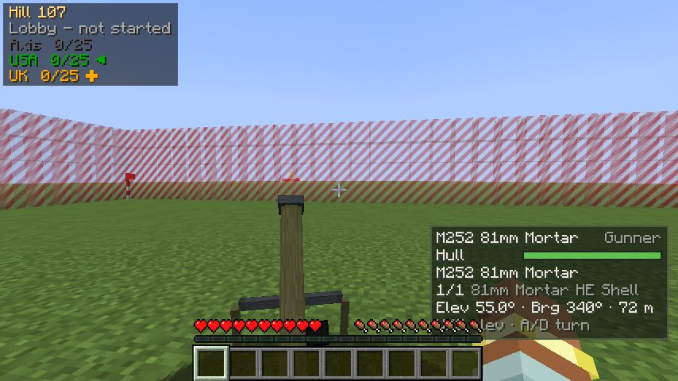
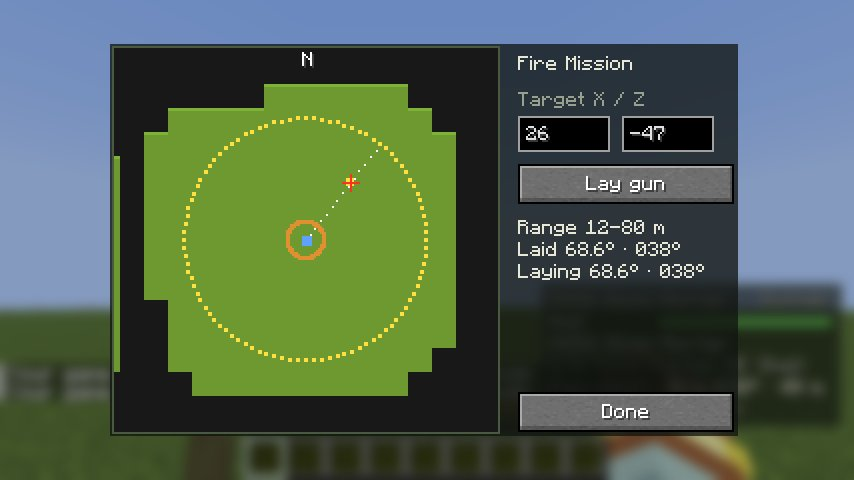
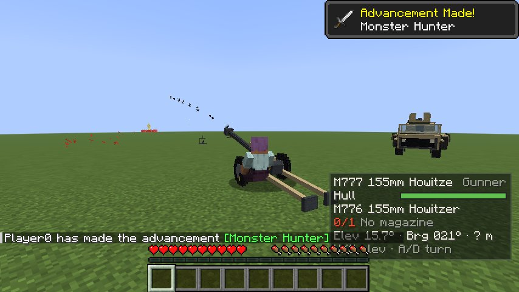

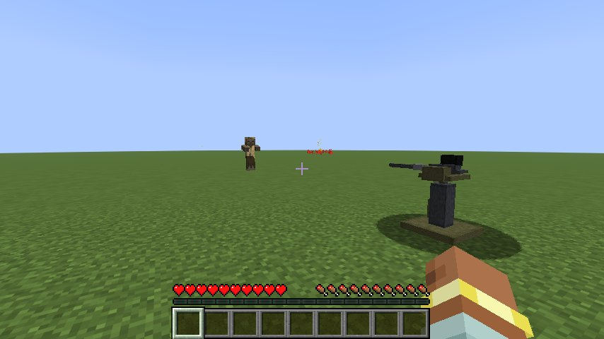
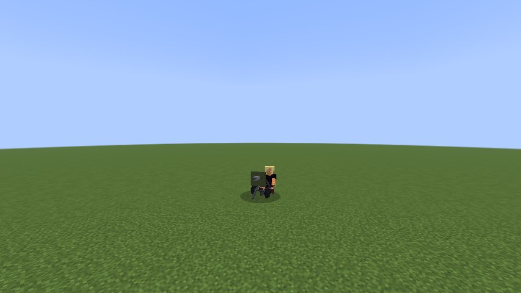

---

## Fuel, cargo and upgrades

- **Vehicle menu (U while riding):** upgrade slots, a fuel slot, the health of every part, and the cargo.
- **Fuel:** vehicles run on petrol or diesel.
  - Fill them from **fuel cans** or park them at a **petrol station**, which refuels everything nearby.
  - Make fuel from coal and water in the **fuel synthesizer**; pipes from other mods work too.
- **Cargo:** most vehicles have storage (a jeep 9 slots, a Humvee 18, the M35 truck a double chest).
  - **Opening it:** use the **Cargo** button in the vehicle menu, or sneak + right click the vehicle with an item in
    your hand.
  - **Keeping it:** the cargo stays in the vehicle item when you pick the vehicle up, and drops when the vehicle is
    destroyed.
- **Upgrades** go into the vehicle menu or straight onto the vehicle with a right click:
  - **Engine:** engine tuning, turbo diesel, supercharger (planes), uprated rotor head (helicopters).
  - **Armour:** armour kits, ERA, side skirts for tanks, cockpit armour for aircraft.
  - **Tyres:** off-road tyres.
  - **Spare fuel:** jerry cans, drop tanks.
  - **Cargo:** cargo racks, stowage bins, helicopter cargo pods.

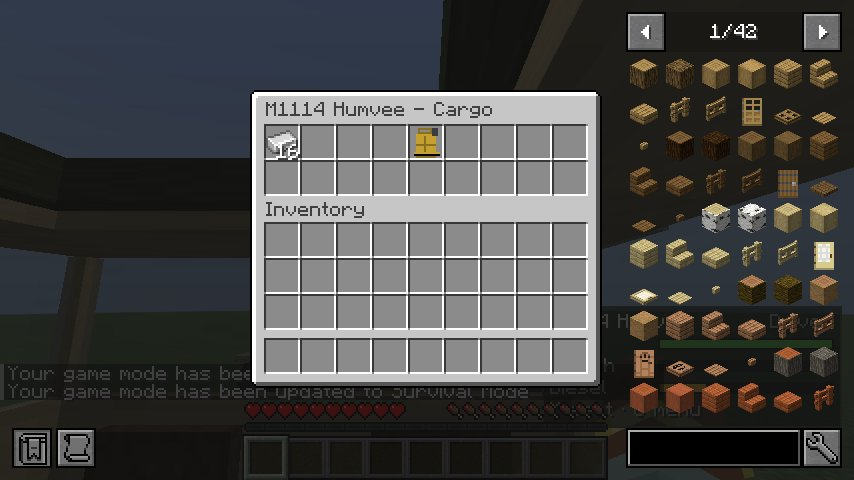
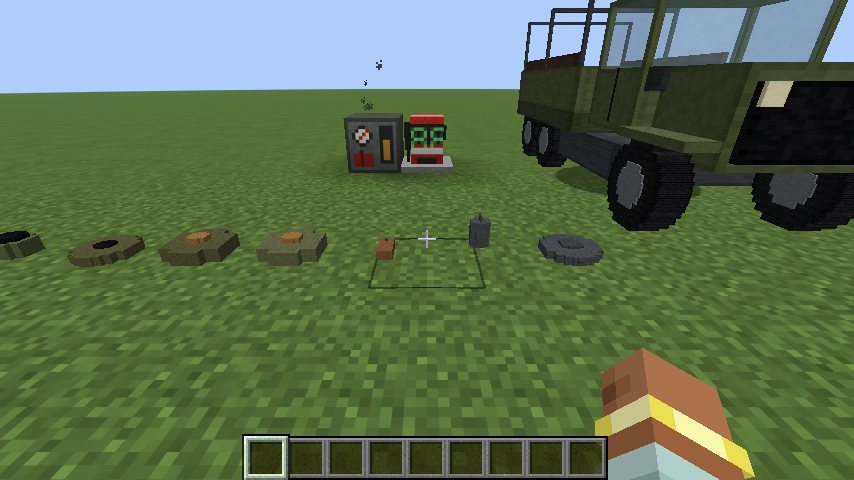
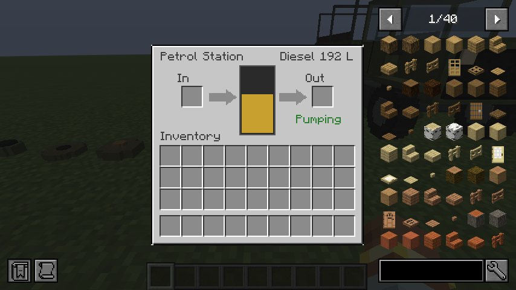

---

## Fortifications and structure kits

**Fortification blocks:**

- **Sandbags and reinforced concrete** (block, slab and stairs); both soak up explosions.
- **Bunker embrasures** you can shoot through.
- **Steel bunker doors and hatches.**
- **Barbed wire:** slows and cuts people and slows wheeled vehicles; tanks flatten it.
- **Czech hedgehogs:** stop vehicles.

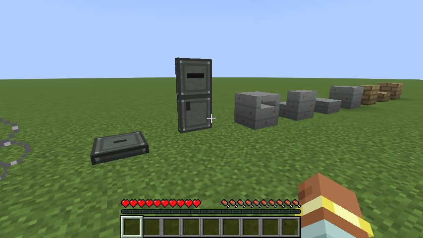

**Structure kits** build a whole position with one right click on the ground. The structure appears in front of you,
its front facing the way you look.

- **Basic pack:** a concrete bunker, a pillbox, straight and corner trenches (dug in, with fire step and parapet), a
  sandbag gun nest, a watchtower, a roadblock, and streets (straight and crossing; chain them forwards).
- **Vehicles pack:** the runway and the aircraft hangar.

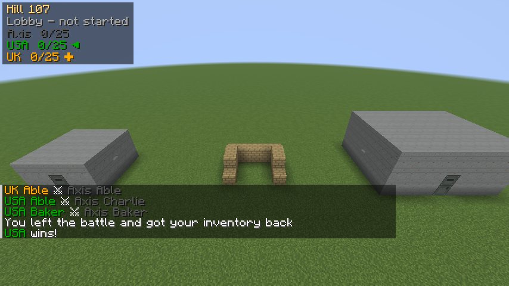
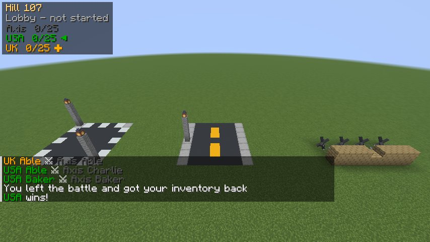
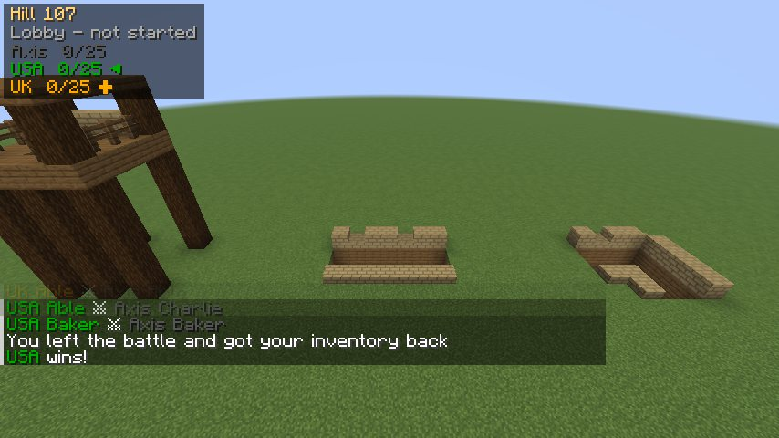

---

## Battles

Battles turn part of a normal survival world into a battlefield, with teams, money, a shop, respawns, objectives and
bots. Your own inventory is safe: it waits at your flag post while you fight.

### Setting up a battle

1. **Place a Battle Master.** Whoever places it (or an operator) manages it. Open it and press **Settings**:
   - mode (see below), teams (`Name:color[:faction]`, e.g. `Axis:dark_gray:flansww2:axis`) and alliances (`USA+UK`);
   - team size, **fill teams with bots**, **bots respawn** (and their delay), and the fighters' game mode (survival
     or adventure);
   - start countdown, capture time, points per held flag, score and time limits;
   - start money, kill reward, income, friendly fire, keep loadout on death, respawn protection;
   - **block damage** (off: nothing in the battle area can be destroyed) and the **border wall**.
2. **Place Team Flag Posts.** A member of a team claims a post as the team's base. The team respawns there, enters
   and leaves the battle there, and shops there. The manager can **lock** a post (it can't be claimed, captured or
   stolen) or make it a **hill** (a neutral objective, labelled A, B, C).
3. **Optional: Battle Spawn Points.** A team's default spawn when it has no flag post. The manager assigns it to a
   team (and so to its faction) while not fighting.
4. **Optional: Border Markers.** Two or more markers near the Battle Master span the battle area, and fighters can't
   leave it. With *border wall* on, a striped wall rises along the edge that only fighters bump into.
5. **Optional: the shop editor.** By default each team's shop is generated from all content (only its faction's gear
   when the team has a faction). With **Shop: <team>** you lay it out yourself: drop items on slots (copies, so
   nothing leaves your inventory), click one and set its price.

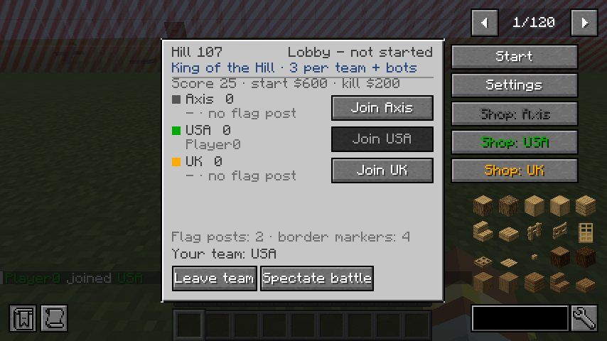
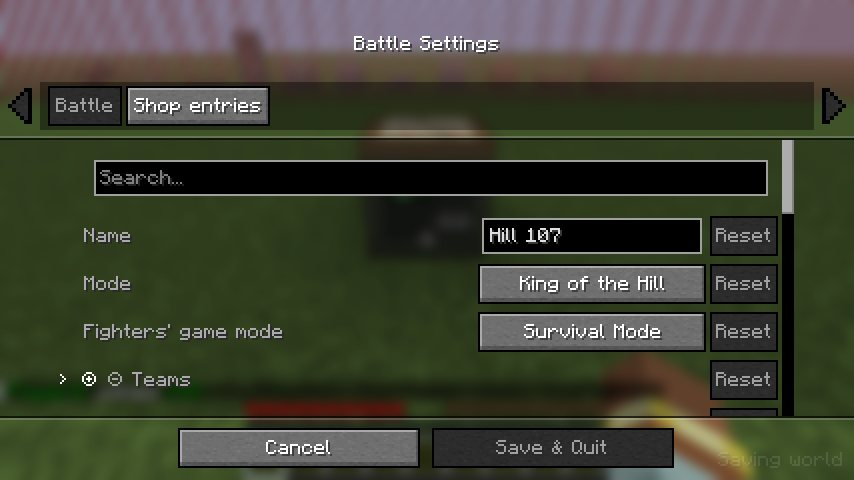

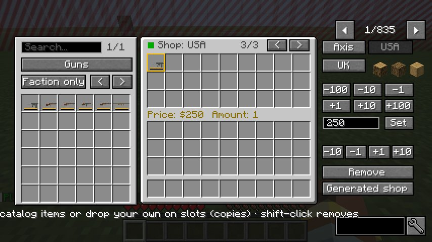
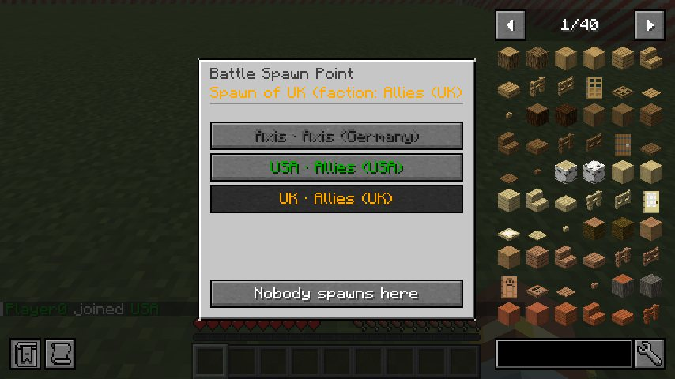
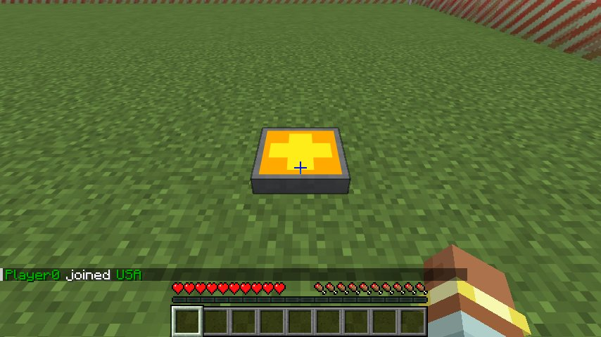

### Playing

1. **Join a team** at the Battle Master. When the manager presses **Start**, everyone on a team enters the battle:
   - your inventory stays behind;
   - you switch to the battle's game mode and get the start money;
   - your spawn point moves to your flag post.

   Players can also join a running battle, or **spectate** it from the Battle Master.
2. A **countdown** runs, during which nobody can be hurt or move far. Then the mode decides how teams score:

   | Mode | Points for |
   |---|---|
   | Team Deathmatch | every enemy killed |
   | Capture the Flag | walking up to an enemy flag post steals its flag (the post stays their spawn); carrying it to your own post scores. A carrier who dies drops it back home. |
   | King of the Hill | standing at a hill alone for the capture time takes it; every held hill scores over time |
   | Conquest | like King of the Hill, but bases can be conquered too (unless locked), and kills score |

   The first team to reach the score limit wins, or the leader when time runs out. Allied teams can't hurt each
   other.
3. **Money:** kills and income pay. Spend it in your flag post's shop.
4. **Respawning** happens at your flag post (or your team's spawn point), with a few seconds of protection. Without
   either, the fallen watch as spectators until the team has one again. A team with no spawn and nobody standing is
   out, and the last side standing wins.
5. **Bots** fill the teams up to the team size. They wear their faction's uniform, carry its guns, shoot real
   bullets, take hills, steal flags, attack bases and open doors on the way. Joining players replace them.
   - **With bots respawn** (on by default), a fallen bot comes back after a few seconds with a new random loadout of
     its faction: at the team's flag post or spawn point, otherwise at the Battle Master.
   - **Without it**, only the first wave fights.
6. **Sentry turrets** placed by a fighter join the battle on their owner's side.
7. **The battle menu (M)** shows every fighter's kills, deaths and captures, the flag posts and their owners, and the
   battle area. Its buttons leave the battle (at your flag post), stop spectating or leave the team.
8. When the battle ends, everyone gets their inventory, game mode and spawn point back.

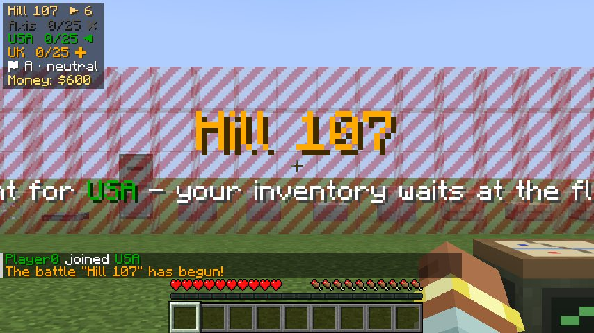
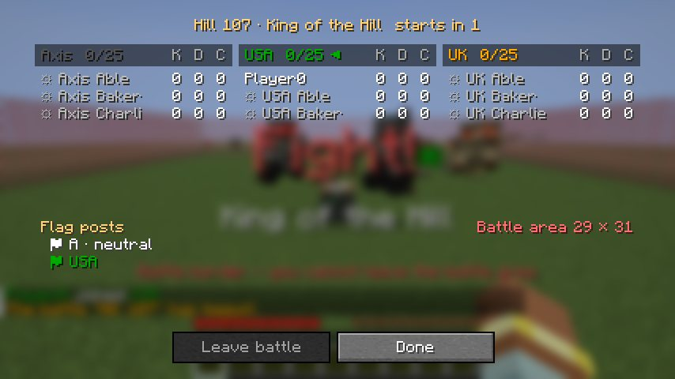

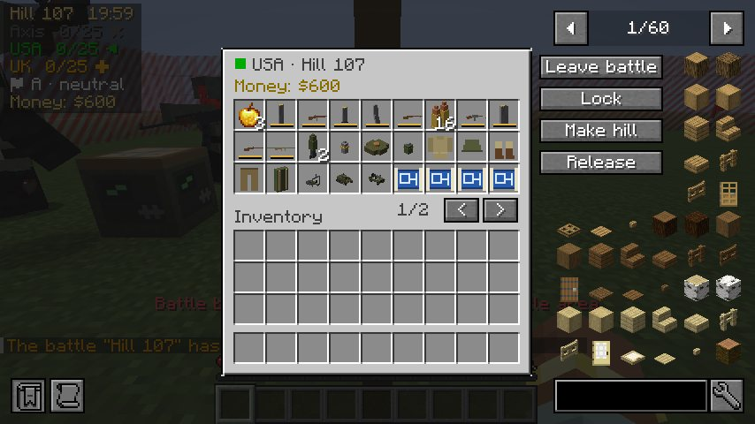
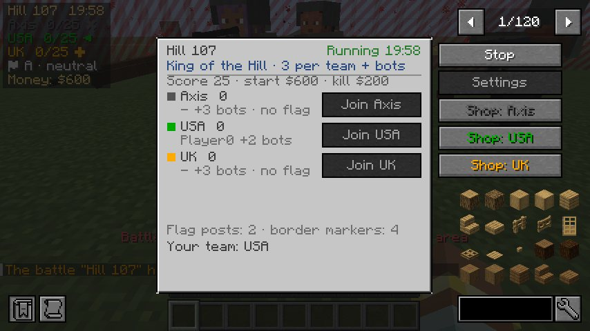
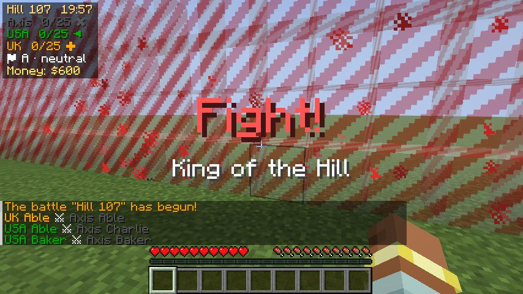

---

## Controls

| Key | Action |
|---|---|
| Left / right click | Fire / aim down sights (vehicle guns: toggle the gunner's sight) |
| R / Sneak+R | Reload / unload |
| K | Fire mode |
| J / Sneak+J | Attach the off-hand attachment / remove all attachments |
| U | Weapon menu (in a vehicle: vehicle menu) |
| Y | Switch vehicle seat |
| H | Secondary vehicle weapon (drop a bomb) |
| N | Artillery map (on a mortar or howitzer) |
| Z | Lie down / stand up |
| B | Open your backpack |
| M | Battle menu |
| Sneak while sprinting | Slide |
| Space while falling | Open your parachute |
| W A S D, Space | Drive and brake; on a mortar or howitzer: elevation, traverse, fine adjustment |
| W/S, look, A/D, Space | Plane: throttle, steer with your view, taxi, brake |
| W A S D, Space, Ctrl | Helicopter: fly, turn, climb, descend |

All keys can be rebound under *Options → Controls → Flan's Mod*. Client settings are in *Mod Menu → Flan's Mod*:
recoil strength, aiming sensitivity, toggle aim, the ammo HUD, the crosshair while aiming, and one creative tab per
content pack.

---

## Built-in content packs

| Pack | Namespace | Contents |
|---|---|---|
| **Basic** | `flansbasic` | 24 modern guns (pistols to anti-materiel rifles, LMGs, M79, RPG-7), magazines, all ammo types, 16 attachments, grenades, army and spec-ops uniforms, backpacks, armour plates, medical gear, binoculars, field map, flashlight, compass, gun parts, 9 structure kits |
| **Vehicles** | `flansvehicles` | M151 jeep, Humvee (M2), M35 truck, BTR-80, M2 Bradley, M1 Abrams, T-72; UH-1H and AH-6 helicopters; M252 mortar, M777 howitzer, Type 63 rocket launcher, ZU-23-2 AA gun, M2HB and Mk 19 on tripods, M240 and 23 mm sentry turrets; tank, mortar and howitzer shells, rockets, bombs, HEI and HE-FRAG rounds; upgrades, vehicle parts, mines, parachute, runway and hangar kits |
| **WW2** | `flansww2` | 4 factions (Axis, USA, UK, Soviet Union): 21 guns, 9 grenades, 5 mines, uniforms, packs; Willys, Kübelwagen, GAZ-67, Universal Carrier, Sherman, Cromwell, Panzer IV, Tiger I, T-34-85; Spitfire, Bf 109, P-51 and Yak-3 fighters; Ju 87, SBD, Il-2 and Fairey Battle attack planes; four mortars, leFH 18, M2A1, QF 25-pounder and M-30 howitzers, 2 cm Flak 38; MG 42, M1919, Vickers and Maxim emplacements |

The WW2 pack needs the other two: shared calibers come from Basic, and vehicle parts and some ammunition from
Vehicles.

---

## Content packs

Anyone can add guns, vehicles, aircraft, emplacements, uniforms, grenades, gear, structures and factions without
writing code. A content pack is a normal Minecraft pack (`pack.mcmeta` + `data/` + `assets/`) dropped into
`contentpacks/`. Definitions reload with `/reload`.

- **[docs/CONTENT_PACKS.md](docs/CONTENT_PACKS.md)**: a step-by-step guide. It starts with the pack layout and a
  first gun (model, magazine, ammunition, recipe), then covers vehicles, aircraft, emplacements, uniforms, gear,
  structures and factions.
- **[docs/DEFINITIONS.md](docs/DEFINITIONS.md)**: every JSON field of every definition type, generated from the code.

---

## Contributing

Bug reports, content packs and code are welcome.

- **[CONTRIBUTING.md](CONTRIBUTING.md)** explains the development setup, workflow and conventions.
- **[docs/ARCHITECTURE.md](docs/ARCHITECTURE.md)** explains how the mod is built, package by package.

---

*Flan's Mod: Recoded is a fan rebuild and is not affiliated with the original Flan's Mod or Mojang.*
