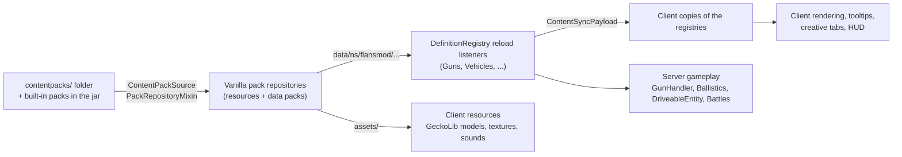
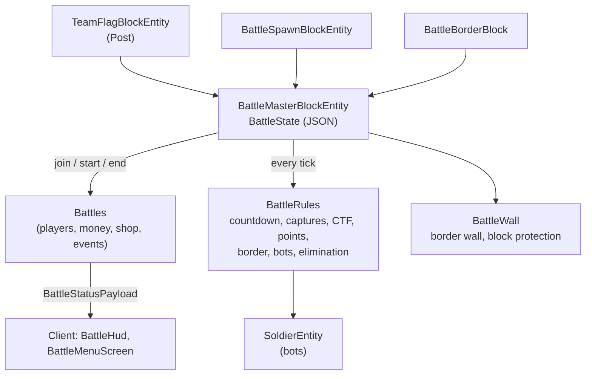

# Architecture

How Flan's Mod: Recoded is built: the big ideas first, then every package with its classes and how they work
together. For the development workflow see [CONTRIBUTING.md](../CONTRIBUTING.md); for the content-pack format see
[CONTENT_PACKS.md](CONTENT_PACKS.md) and [DEFINITIONS.md](DEFINITIONS.md).

**Contents:** [Principles](#principles) · [Source sets](#source-sets-and-entrypoints) ·
[Content pipeline](#the-content-pipeline) · [One item, many things](#one-item-many-things) ·
[Networking](#networking) · [Saved and synced state](#saved-and-synced-state) · [Packages](#packages) ·
[Client](#client-packages) · [Mixins](#mixins) · [Built-in packs and generators](#built-in-packs-and-generators) ·
[Tests](#tests)

---

## Principles

1. **Data-driven.** The mod code contains no guns, vehicles or uniforms. Everything comes from content packs: JSON
   definitions in `data/`, models, textures and sounds in `assets/`. The three built-in packs are ordinary content
   packs inside the jar.
2. **Server authority.** The server decides every hit, every round fired and every point scored. Clients send
   intents (trigger pulled, reload pressed) and draw what the server tells them (tracers, muzzle flashes, HUDs).
3. **Libraries and vanilla first.** GeckoLib renders models, kotlinx.serialization parses definitions, Fabric API
   does networking, resource loading, menus, data attachments and events, and Cloth Config draws settings screens.
   Vanilla systems are used wherever they fit: menus, item components, equipment assets, scoreboard teams,
   structure templates, explosions, AI goals. New code is only written for Flan's own gameplay.
4. **Mixins are a last resort**, written in Java, small, and documented with their compatibility impact. Everything
   else is Kotlin.

---

## Source sets and entrypoints

| Source set | Path | Contents |
|---|---|---|
| `main` | `src/main/kotlin`, `src/main/java` (mixins), `src/main/resources` | everything that runs on both sides: registries, definitions, gameplay, networking, built-in packs |
| `client` | `src/client/kotlin`, `src/client/java` (mixins), `src/client/resources` | rendering, HUDs, input, screens, creative tabs, JEI/Mod Menu integration |
| `gametest` | `src/gametest/kotlin`, `src/gametest/resources` | server GameTests, client GameTests (screenshots), the `example` test pack |

Entrypoints (`src/main/resources/fabric.mod.json`):

| Entrypoint | Class | Does |
|---|---|---|
| `main` | `FlansMod` | registers components, blocks, block entities, items, entities, menus, recipes and payloads; loads content; registers the built-in packs; starts the server-side handlers |
| `client` | `client.FlansModClient` | config, item model type, payload receivers, renderers, screens, HUDs, key mappings, creative tabs |
| `modmenu` | `client.config.ModMenuIntegration` | config screen in Mod Menu |
| `jei_mod_plugin` | `client.compat.FlansJeiPlugin` | Weapons Bench recipes in JEI (only when JEI is installed) |

All registrations live in `registry/FlansRegistry.kt` (`FlansComponents`, `FlansItems`, `FlansBlocks`,
`FlansBlockEntities`, `FlansMenus`, `FlansRecipes`, `FlansEntities`, `FlansDamageTypes`), except fortification
blocks (`Fortifications`) and gear (`GearItems`), which register their own.

---

## The content pipeline

1. **Discovery** (`contentpack/ContentPackSource`, `mixin/PackRepositoryMixin`): every folder or zip in
   `<game dir>/contentpacks/` is added as a required pack to the client resource repository and to every world's
   data pack repository. Vanilla reads the files (`FolderRepositorySource.discoverPacks`); there is no custom file
   I/O. The built-in packs are registered with Fabric's `ResourceLoader.registerBuiltinPack` and are enabled by default.
2. **Loading** (`gun/Guns.kt`): `DefinitionRegistry<T>` is one reload listener per definition type. It reads
   `data/<ns>/flansmod/<folder>/*.json` with kotlinx.serialization (`Content.JSON`: lenient, comments allowed,
   unknown keys ignored). The instances are `Guns`, `Attachments`, `AmmoTypes`, `Grenades`, `Magazines`, `Parts`,
   `Clothing`, `Vehicles`, `VehicleUpgrades`, `Factions`, `Gear` and `Structures`. `/reload` works.
3. **Sync** (`Content`): on join and after every reload the server sends all definitions in one
   `ContentSyncPayload` (JSON, up to 8 MB). The client replaces its registries and runs `Content.onChanged`
   (creative tabs, shop caches).
4. **Use:** gameplay reads definitions by id (`Guns[id]`). Effective values are computed on the fly, e.g.
   `ItemStack.definition` is the gun with its attachments applied, and `DriveableEntity.definition` is the vehicle
   with its upgrades applied.

Adding a new definition type: write a `@Serializable` data class, add a `DefinitionRegistry` instance in `Guns.kt`,
add it to `Content.init`, `Content.syncPayload`, `Content.apply` and a field to `ContentSyncPayload`, and list it in
`tools/generate_docs.py`.

---

## One item, many things

Content packs can't register items, because registries are frozen before packs load and a `/reload` couldn't add
new ones. So there is **one item per kind of thing**, and a data component says which definition a stack is:

| Item | Component | Notes |
|---|---|---|
| `flansmod:gun` | `flansmod:gun` | + `flansmod:magazine` (inserted magazine), `flansmod:attachments` (slot → id), `flansmod:fire_mode`, `flansmod:reloading` |
| `flansmod:magazine` | `flansmod:magazine` (`MagazineContents`: type, ammo, rounds) | identical magazines stack |
| `flansmod:ammo` | `flansmod:ammo_type` | |
| `flansmod:attachment` | `flansmod:attachment` | |
| `flansmod:grenade` | `flansmod:grenade` | also mines |
| `flansmod:part` | `flansmod:part` | crafting components |
| `flansmod:clothing` | `flansmod:clothing` | gets vanilla `equippable` + `attribute_modifiers` from the definition |
| `flansmod:gear` | `flansmod:gear` | backpacks (vanilla `container`), medical (vanilla `consumable`), plates (vanilla `max_damage`/`damage`), parachutes |
| `flansmod:vehicle` | `flansmod:vehicle` | + `flansmod:fuel`, `flansmod:vehicle_upgrades`, `flansmod:vehicle_damage` when picked up |
| `flansmod:vehicle_upgrade` | `flansmod:vehicle_upgrade` | |
| `flansmod:structure` | `flansmod:structure` | structure kits |
| `flansmod:fuel_can` | `flansmod:fuel_can` (`FuelStack`) | |

Each item class has a `stackFor(id)` factory and extension properties such as `ItemStack.gunId` and
`ItemStack.definition`. Icons come from the item model type `flansmod:definition_icon` (`client/render/DefinitionIconModel`),
which renders the model named by the definition's `icon` at render time, so stacks and recipes never need an
explicit `minecraft:item_model`. Guns render with GeckoLib (`GunRenderer`).

---

## Networking

Everything uses the Fabric Networking API (`PayloadTypeRegistry`, `ServerPlayNetworking`, `ClientPlayNetworking`).
Most payloads are in `network/Payloads.kt` and registered in `FlansNetworking`; feature packages register their own.

| Payload | Direction | Purpose |
|---|---|---|
| `ContentSyncPayload` | S → C | all definitions |
| `ShootPayload`, `ReloadPayload`, `AimPayload`, `FireModePayload`, `AttachPayload` | C → S | gun intents |
| `ShotPayload` | S → C (shooter + trackers) | draw tracers and muzzle flash |
| `HitPayload` | S → C | hit marker |
| `OpenWeaponMenuPayload`, `OpenVehicleMenuPayload`, `SwitchSeatPayload` | C → S | menus, seats |
| `SecondaryFirePayload` | C → S | fire the seat's second weapon (H: bombs) |
| `CrashPayload` (in `aircraft`) | C → S | the pilot's client reports a crash; the server applies the hull damage |
| `StancePayload` | C → S | prone, slide |
| `OpenBackpackPayload` | C → S | backpack key |
| `BattleStatusPayload` | S → C | battle HUD and battle menu, about once a second |
| `BattleSettingsPayload`, `BattleActionPayload` | C → S | Battle Master settings, battle menu buttons |

Menus with extra opening data use Fabric's `ExtendedMenuType` (weapon, vehicle, Battle Master, flag post, shop editor
and spawn point menus); buttons use vanilla's `clickMenuButton`. Vehicle movement uses vanilla's boat mechanism
(`ServerboundMoveVehiclePacket`), which also carries a plane's pitch (`xRot`).

---

## Saved and synced state

| What | Where | Mechanism |
|---|---|---|
| Item state (magazine, attachments, fire mode, fuel, ...) | item stacks | data components (`FlansComponents`) |
| Battle membership, money, stashed inventory, previous game mode and spawn | player | Fabric data attachment `flansmod:battle` (`BattlePlayer`), persistent, copied on death |
| Spectator return point | player | attachment `flansmod:battle_spectator` |
| Worn backpack | player | attachment `flansmod:back`, synced to everyone (drawn on the back) |
| Prone / slide | player | attachments `flansmod:prone`, `flansmod:slide`, synced |
| Open parachute | player | attachment `flansmod:parachute` (gear id), synced, not saved |
| Battle state (settings, roster, scores, posts, bots, stats, border) | Battle Master block entity | `BattleState` as JSON; team shops via the item codec |
| Vehicle fuel, health, part damage, seat magazines, upgrades | vehicle entity | entity data with custom serializers (`FabricEntityDataRegistry`) |

---

## Packages

All under `com.flansmod.recoded` in `src/main/kotlin`.

### `gun`: definitions and content loading

| Class | Role |
|---|---|
| `Guns.kt` | `DefinitionRegistry<T>` and its instances; `Content` (JSON format, reload listeners, client sync) |
| `GunDefinition` | a gun: damage, fire rate and modes, magazines, ballistics, spread, recoil, scope, sounds, display transforms, attachment slots; plus `ModelInfo`, `Transform`, `Tracer`, `Scope` |
| `AmmoDefinition`, `MagazineDefinition` | rounds (caliber, effects: armour piercing, fire, pellets, projectile) and magazines (caliber, capacity, internal) |
| `MagazineContents` | what's in a magazine (vanilla codecs, because it's an item component) |
| `AttachmentDefinition` | sights, muzzle devices, grips, bipods (`deploy`), lasers; multipliers |
| `GrenadeDefinition` | explosion (+ limited `block_damage`), smoke, flash, `mine` |
| `ClothingDefinition`, `PartDefinition`, `FactionDefinition`, `StructureDefinition` | uniforms, crafting parts, sides of a conflict, structure kits |
| `VehicleDefinition`, `VehicleUpgradeDefinition` | vehicles (parts, seats, fuel, handling) and upgrades |

### `item`: the generic items

`GunItem`, `MagazineItem`, `AmmoItem`, `AttachmentItem`, `GrenadeItem`, `PartItem`, `ClothingItem`, `VehicleItem`,
`VehicleUpgradeItem`, `WrenchItem`, `StructureItem` (see [One item, many things](#one-item-many-things)).

- `AmmoLoading` moves loose rounds between the inventory and magazines.
- `Tooltips` gives every item the same tooltip layout.
- `ClothingItem.applyDefinition` turns a clothing definition (plus inserted armour plates) into vanilla components.
- `StructureItem.place` puts a vanilla structure template in front of the player, rotated to the facing.

### `combat`: shooting and explosions (server)

| Class | Role |
|---|---|
| `GunHandler` | firing (fire rate, burst, safe), reloading and unloading, aiming (slowdown, night vision), spread from stance |
| `Ballistics` | bullets as points, not entities: velocity, gravity, drag and a block + entity raycast per tick; damage, headshots, incendiary, explosive/HEI rounds (`explosion`: a small blast on impact), flak (proximity/time fuze bursts near aircraft); any `LivingEntity` can shoot (players, bots, vehicle crews) |
| `VehicleWeapons` | seat guns (`mounted: true` definitions): aim from the seat, muzzle position, magazines stored per weapon slot (seat index; seat + `DriveableEntity.SECONDARY` for a seat's `secondary` weapon); bombs (`drop`) leave with the vehicle's velocity |
| `AttachmentHandler` | installing and removing attachments (J key) |
| `Artillery` | fire control: simulated flight of an emplacement's loaded round (impact point), maximum range, and the laying that hits a target (`solve`: the flat trajectory for guns that can fire below 45°, else the high angle) |
| `Explosives` | detonations: vanilla explosion + fire + limited block damage by grenade type |
| `Incendiary` | fire placement |

### `entity`: entities

- **`DriveableEntity`** is every vehicle (aircraft included), built on vanilla's `VehicleEntity`. The driver's client simulates movement
  (like boats); without a player driver the server does. Parts are hit boxes with their own health and role
  (`hull`, `engine`, `propulsion`, `weapon`, `fuel_tank`). Bullets hit only where a part is (`raycastParts`). Each tick
  it samples the ground under the wheels and tilts the body (`bodyPitch`/`bodyRoll`); `toWorld`/`toLocal` convert
  between vehicle space `[right, up, forward]` and the world. Seats, fuel, upgrades and repairs live here too.
- Planes and helicopters are `DriveableEntity`s too: the entity hands their movement and body pose to
  [`aircraft`](#aircraft-planes-and-helicopters) and keeps everything else (seats, parts, fuel, guns, upgrades).
- **`GrenadeEntity`** is a vanilla throwable projectile with bouncing, a fuse and the detonation effects. Launcher
  rounds are grenades too.
- **`MineEntity`** is a mine on the ground. It arms after a delay and is triggered by people or vehicles.

### `aircraft`: planes and helicopters

Aircraft reuse the whole vehicle stack. Only flying is new, and it lives in this package. `DriveableEntity` calls in
at four points: `simulate` (movement), the body pose, `afterMove` (crashes) and `positionRider` (the plane's pilot
isn't turned with the plane).

| Class | Role |
|---|---|
| `FlightDefinition` | the `flight` section of a vehicle definition (lift speed, pitch rate, bank, climb speed, crash limits) |
| `FlightModel` | arcade flight on the simulating side, like driving (the pilot's client, else the server): planes keep a throttle setting, follow the pilot's view in the air, need `lift_speed` and stall below it; helicopters hover, climb (jump) and descend (sprint key) and autorotate without power. Bank and helicopter tilt are derived from the movement on every side and fed into `bodyPitch`/`bodyRoll`, so seats, gun mounts and hit boxes follow them without extra syncing |
| `FlightState` | per-entity throttle, engine spool, rotor angle and measured velocity (not saved) |
| `Aircraft` | `CrashPayload`: the pilot's client reports impacts, the server checks that the sender flies the aircraft and applies the damage |

Notes:

- **Vanilla's anti-fly kick:** `DriveableEntity.isFlyingVehicle()` is true for aircraft. Otherwise the server would
  kick pilots for floating.
- **Fall damage:** aircraft don't pass vanilla fall damage on to their crew (`causeFallDamage`). A long glide down is
  no fall, and hard landings are crashes.
- **Wings and rotors** are `propulsion` parts, so `DriveableEntity.propulsion` scales the lift or rotor power.
- **Fixed guns** (seat gun without `turret`) fire along the nose: `DriveableEntity.aim` returns the body pitch for
  aircraft. Bombs are a seat's `secondary` weapon with `drop: true`.
- **Bailing out:** aircraft only run things over on the ground (in the air they would hit the pilot who just left).
- **Anti-aircraft guns** are emplacements with `lay_with_keys: false`: aimed with the view like turrets.

### `bench`: crafting and item menus

- `WeaponsBench` (block + `WeaponsBenchMenu`) and `WeaponAssemblyRecipe`: a 6×4 shaped recipe type, because
  vanilla's codec stops at 3×3. Ingredients are vanilla ingredients; parts are matched through Fabric's
  `fabric:components` ingredient. Recipes are synced to clients with Fabric's `RecipeSynchronization` for JEI.
- `WeaponMenu`: attachment slots that *are* the gun's attachment component, plus fire-mode buttons.
- `VehicleMenu`: upgrade slots that *are* the vehicle's upgrades, plus a fuel slot and a cargo button.
- `VehicleStorageMenu`: a vehicle's cargo (`DriveableEntity.storage`, saved; kept in the item's vanilla `container`
  component when picked up; dropped when destroyed) as a vanilla chest menu.

### `fuel`: vehicle logistics

`FuelCan` (`FuelStack` = fuel type + amount, `FuelCanItem`) and `FuelBlocks`: the fuel synthesizer (coal + water →
petrol/diesel; water via buckets or the Fabric Transfer API) and the petrol station (refuels vehicles in range).
Both are vanilla container block entities with menus.

### `fortification`: field fortifications

`Fortifications` registers sandbags and reinforced concrete (block, slab, stairs), the embrasure (a firing slit in
its collision shape), bunker door and hatch (`BlockSetTypeBuilder`), barbed wire and Czech hedgehogs, all on vanilla
block classes.

### `gear`: accessories

- `Gear.kt`: `GearDefinition` (backpack, pouch, medical, binoculars, plate, parachute), `GearItem` and `BackpackMenu`, a
  vanilla chest menu over the item's `container` component.
- `Parachutes`: opening with the jump key while falling (server, `lastClientInput`), the synced attachment
  `flansmod:parachute`, no fall distance while open; the client caps the sink rate and draws the canopy.
- `GearSlots`: the backpack slot (attachment `flansmod:back`) and armour-plate slots (stored in the worn chest
  piece). `InventoryMenuMixin` adds them to the inventory, and plates wear out on hits (`AFTER_DAMAGE`).

### `utility`: field utilities

Gear types `map`, `flashlight` and `compass` (definitions are ordinary gear; `GearItem` hands them to this package).

- `Utilities`: the `flansmod:active` component (a flashlight that is on) and the hook the client sets to open the map.
- `Flashlights`: per player holding a switched-on flashlight, one vanilla **light block** (`minecraft:light`, level
  from the definition) in the air just before what the beam hits. It follows the beam, is removed when the light goes
  off, the player leaves or the server stops, and only ever replaces air. Real block light: everyone sees it, no
  client rendering or dynamic-lights mod needed.

### `emplacement`: sentry turrets

- `SentryDefinition`: the `sentry` section of an emplacement (range, target kinds, turn speed).
- `Sentries`: the AI of an unmanned sentry (called from `DriveableEntity.tickServer`): picks the nearest valid
  target in sight (hostile mobs; enemy battle fighters and their aircraft relative to the owner, via
  `Battles.enemies`), turns `DriveableEntity.sentryAim` (synced, drives the model's bones) towards where the target
  will be, and fires through `VehicleWeapons.fireSentry` (the turret is the shooter, its owner the cause; empty guns
  reload from the turret's cargo).

### `movement`: stances

`Stance`: prone (Z) and sprint slide force vanilla's crawling pose (`PlayerPoseMixin`). Both are synced
attachments, and they lower spread and recoil. Climbing is client-side (`client/movement/MovementClient`).

### `gamemode`: battles

The largest package. The flow of a battle:

| Class | Role |
|---|---|
| `BattleSettings.kt` | `BattleSettings` (everything the Settings screen edits), `BattleTeam`, `BattleMode`, the player attachments `BattlePlayer` and `BattleSpectator` |
| `BattleMaster.kt` | the Battle Master block and block entity: `BattleState` (roster, scores, posts, spawns, stats, CTF carriers, bots, border, watchers), shops, border wall bookkeeping, scoreboard teams, its menu; `BattleMasterBlockEntity.near` finds the battle of a placed marker or post |
| `Battles` | membership (join, quit), entering and leaving (stash and restore inventory, game mode, spawn point), spectating, start and end, score, money and the shop (custom or generated per faction), status sync, and the damage/death/respawn/join events |
| `BattleRules` | per-tick rules: countdown titles, King of the Hill/Conquest captures and points, Capture the Flag stealing and delivery, the border push-back, bot upkeep (filling teams, respawning fallen bots with a new loadout when `bot_respawn` is on), redeploying players who waited, elimination |
| `TeamFlag.kt` | `TeamFlagBlock` (`color`, `stolen` block states), its block entity (claim, lock, hill, release) and the shop menu |
| `BattleSpawn.kt` | default spawn points, assigned to a team by a moderator |
| `BattleBorder.kt` | border markers |
| `BattleWall.kt` | the border wall (built in batches, solid only for fighters) and `protects()` for battles without block damage |
| `ShopEditor.kt` | the per-team shop editor menu, `ShopCatalog` (everything a shop can sell, by group and faction) and the search payload |
| `SoldierEntity` | bots: `PathfinderMob` with faction gear, `GunAttackGoal` (real bullets), `ObjectiveGoal` (mode objective), door opening; outside battles (`masterPos` null) a placed soldier with `faction` and `attitude` |
| `FactionSoldiers.kt` | `SoldierAttitude` (friendly, enemy, neutral, inactive = NoAI), `SoldierSpawn` (component of the `flansmod:soldier` item, `SoldierItem`), who fights whom, and no friendly fire between allies |

Key ideas:

- A **fighter** is a player inside the running session, or a bot of that battle (`Battles.fighter`). Damage,
  collisions with the wall, and captures all ask that question.
- A team **respawns** at `master.spawn(team)`: a flag post, else its default spawn point. If there is neither, the
  player waits as a spectator (`BattlePlayer.waiting`).
- **Sessions:** each start creates a session id. Players and bots from an older session are restored or removed.
- **Bots** leave the roster only when they die or are removed (`SoldierEntity.remove` → `BattleRules.botGone`),
  because `level.getEntity` doesn't see entities in loaded chunks that aren't ticking.

### `trenches`: the Trenches mode

`BattleMode.TRENCHES` is a battle like the others (teams, roster, bots, HUD, spectating, border all come from
`gamemode`); `BattleRules` hands its tick to `TrenchRules`, and trench soldiers are `SoldierEntity` bots with a unit.

| Class | Role |
|---|---|
| `TrenchDefinitions.kt` | `TrenchUnitDefinition` (squad: soldiers with role, gun categories, stats, mortar/grenades/aura), `TrenchSupportDefinition` (barrage, gas); registries `TrenchUnits`, `TrenchSupports` (`data/<ns>/flansmod/trench_units|trench_supports`, server only - the command screen gets names and costs through the status) |
| `TrenchState.kt` | `TrenchSettings` (in `BattleSettings.trenches`), `TrenchState` (in `BattleState.trench`: funds, commanders, cooldowns, bunkers, wire, HQ capture, jobs, shells in flight, force-loaded chunks), `TrenchView` (sent inside `BattleStatus`), `TrenchCommandPayload` |
| `TrenchLayout` | the lane from the posts: first team's base (zone 0), hill posts ordered along the axis, second team's base; `zoneAt`, `slot` (where soldier n stands in a zone) |
| `TrenchRules` | the tick (income, captures, storming a HQ, slots, officer auras, mortars, grenades, engineering jobs, shells, the AI), cover, the MG loader, and the commands: `buy`, `order`, `orderAll`, `support`, `job`; the command screen's view |
| `TrenchAi` | the computer commander: buying by role mix, moving up and pushing on, falling back, supports, bunkers and wire |
| `TrenchField` | builds the field in front of the Battle Master and registers its posts and border |

Key ideas:

- **Zones** are indices into the lane: 0 = the first team's headquarters, the last = the second team's. A soldier's
  `order` is the zone it should be in, `slot` its place there; `ObjectiveGoal` walks it there and `TrenchFireGoal`
  shoots without leaving it.
- **Bases** are a team's posts that are not hills (`master.flag(team)` would return a captured trench line).
- The field's chunks are **force-loaded** while the battle runs: soldiers out of every player's range would stand still
  and `level.getEntity` would not find them.
- Shells are scheduled (`TrenchShell`) and explode without breaking blocks; barrage shells have no shooter and hit
  everyone, mortar shells spare the mortar's side.

### `contentpack`, `network`, `registry`

`ContentPackSource` (see [Content pipeline](#the-content-pipeline)), `Payloads.kt`
(see [Networking](#networking)), `FlansRegistry.kt` (see [Source sets](#source-sets-and-entrypoints)).

---

## Client packages

All under `com.flansmod.recoded.client` in `src/client/kotlin`.

| Package | Classes | Role |
|---|---|---|
| (root) | `FlansModClient` | client entrypoint |
| `render` | `GunGeoModel`, `GunRenderer`, `DefinitionIconModel` | one GeckoLib model/renderer for all guns (files picked per stack; bone visibility for attachments, magazines, muzzle flash; first-person arms in the player's skin via `SkinArmLayer`; display transforms from the definition, blended to the `ads` pose) and the `definition_icon` item model type |
| `input` | `GunInput` | mouse to shoot/reload payloads, aiming state, procedural recoil, key mappings R/K/U/Y/J |
| `hud` | `GunHud`, `ScopeOverlay` | ammo counter and hit marker; scope overlays and thermal highlight |
| `fx` | `ShotEffects` | replays each shot visually: tracer from the muzzle that meets the server's bullet path, muzzle flash |
| `vehicle` | `VehicleRenderer`, `VehicleClient`, `VehicleHud`, `VehicleMenuScreen`, `ArtilleryClient`, `ArtilleryMapScreen` | GeckoLib vehicle rendering (wheels, steering, turrets, rotors and propellers, muzzle flash), camera distance, engine sound, HUD, menu, mortar impact marker, the artillery map (terrain from vanilla map colours in a dynamic texture; a click lays the gun via `DriveableEntity.layTarget`) |
| `aircraft` | `AircraftClient` | the helicopter descend key (vanilla's sprint key), crash reports, flight instruments for the vehicle HUD (altitude, climb rate, stall warning) |
| `utility` | `UtilityClient`, `FieldMapScreen`, `CompassHud`, `TerrainMap` | the field map (terrain, heading, allies, waypoint), the compass strip (heading, waypoint), and `TerrainMap`, the terrain image both maps use (vanilla map colours from the loaded chunks in a dynamic texture) |
| `gear` | `GearClient` | backpack key, binocular zoom, backpack on the back (`BackpackLayer`), parachute canopy (`ParachuteLayer`) and sink rate, laser dots, gear slot frames |
| `movement` | `MovementClient` | prone key, slide, climbing |
| `gamemode` | `BattleScreens` (Battle Master, flag post, shop editor, spawn point, Cloth settings), `BattleHud`, `BattleMenuScreen` (M), `SoldierRenderer` | battle UI; bots drawn with the vanilla player model and armour layer |
| `trenches` | `TrenchCommandScreen` (M in a Trenches battle) | the lane, orders, engineering, supports and squads; keys A/D, W/S, 1-8 |
| `bench` | `WeaponsBenchScreen`, `WeaponMenuScreen` | bench and weapon menu screens |
| `fuel` | `FuelScreens`, `MineRenderer` | fuel machine screens, mines on the ground |
| `tab` | `TypeTabs`, `FactionTabs`, `PackTabs`, `CreativeContent` | creative tabs by type, per faction and (optionally) per pack; `CreativeContent` decides order and grouping |
| `config` | `FlansConfig`, `ModMenuIntegration` | client options (Cloth Config AutoConfig) |
| `compat` | `FlansJeiPlugin` | JEI category for the bench, subtypes, recipe transfer, keeping JEI clear of side buttons |

---

## Mixins

Each mixin's Javadoc explains what it changes and why it shouldn't conflict with other mods.

| Mixin | Side | Purpose |
|---|---|---|
| `PackRepositoryMixin`, `FolderRepositorySourceAccessor` | both | adds `contentpacks/` to the resource and data pack repositories |
| `InventoryMenuMixin` | both | backpack and plate slots, appended after the vanilla slots |
| `PlayerPoseMixin` | both | crawling pose for prone and slide |
| `ServerLevelMixin` | server | explosions in battles without block damage keep the blocks |
| `AvatarRendererMixin` | client | crossbow-hold pose with guns; worn backpack and open parachute in the render state |
| `CameraMixin` | client | aiming zoom, binoculars, vehicle camera distance and gunner sight camera |
| `GameRendererMixin` | client | no view bobbing while aiming; no hand in gunner sights |
| `MouseHandlerMixin` | client | lower sensitivity while aiming |
| `MinecraftGlowMixin` | client | thermal scope outlines |
| `CreativeInventoryScreenMixin`, `AbstractContainerScreenAccessor` | client | gear slot positions in the creative inventory |
| `CreativeModeTabsAccessor` | client | rebuild creative tabs when definitions change |

---

## Built-in packs and generators

The built-in packs in `src/main/resources/resourcepacks/` are **generated**. Edit the Python generators in `tools/`,
not the JSON or PNG files.

| Script | Writes |
|---|---|
| `gunsmith.py` | (module) gun and magazine models in real proportions, material texture |
| `generate_basic_pack.py` | `resourcepacks/basic` (`flansbasic`): guns, ammo, magazines, attachments, grenades, uniforms, gear, parts, bench recipes, structure kits |
| `vehiclesmith.py` | (module) vehicle models: cabins, interiors, wheels, tracks, turrets, mounts with their gun positions |
| `aircraftsmith.py` | (module) aircraft models: piston fighters and attack planes (round fuselage, wings as their own bones, propeller, rear gunner, bombs) and helicopters (rotor, tail rotor, skids, door guns), fixed gun mounts |
| `generate_vehicle_pack.py` | `resourcepacks/vehicles` (`flansvehicles`), including the helicopters and aircraft parts |
| `generate_ww2_pack.py` | `resourcepacks/ww2` (`flansww2`), including the fighters, using the writers of the two generators above |
| `structuresmith.py` | (module) structure templates (`.nbt`, 26.3 palette format: `id`/`properties`) |
| `generate_mod_assets.py` | the mod's own assets: blocks, GUIs, icons, recipes, loot tables, tags |
| `generate_trenches_pack.py` | `resourcepacks/trenches` (`flanstrenches`): Trenches squads and supports |
| `generate_example_pack.py` | the `example` pack for tests and the dev client |
| `generate_docs.py` | `docs/DEFINITIONS.md` from the Kotlin definition classes |

Run them in this order: basic → vehicle → ww2 → mod_assets → example. Then restore the armour textures that the
basic generator rewrites (`git checkout -- src/main/resources/resourcepacks/basic/assets/flansbasic/textures/entity`)
and delete `tools/__pycache__`.

---

## Tests

- **Server GameTests** (`./gradlew runGameTest`, part of `./gradlew build`) are in `src/gametest/kotlin/.../test/*GameTests.kt`
  and cover guns, ammo, attachments, grenades, vehicles, aircraft, utilities, gear and movement, battles and structures. Tests
  drive rules through Fabric event invokers where mock players can't (mock players are creative and their
  `gameMode()` is fixed).
- **Client GameTests** (`./gradlew runClientGameTest`) start a real client, play through features and save
  screenshots to `build/run/clientGameTest/screenshots` (the images in `docs/images` come from there). They also
  check that every item appears in exactly one creative tab.
- **Shared state:** definitions are global, so test content uses its own ids, calibers and short bullet ranges.
  Entities in GameTest areas aren't always ticked, so tests tick them themselves when it matters. Test areas may
  be rotated and have a roof.
